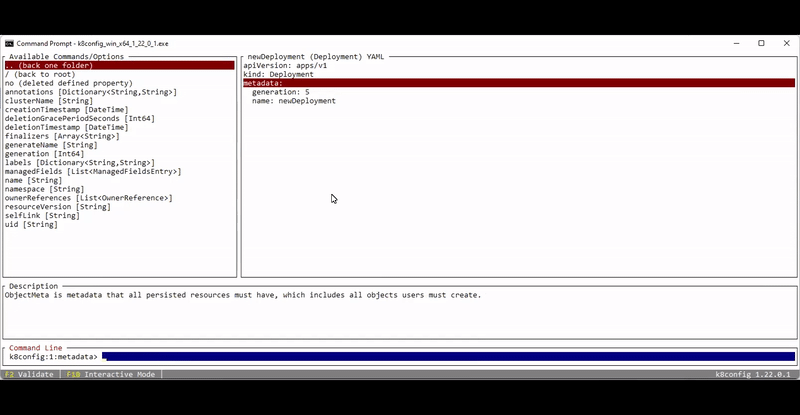

# Overview

This project aims for showcase the usage of dotnet reflection in creating dynamic nested objects and walking those object with a text based editor to build out Kubernetes configuration files in memory. This utility also aims to show how the current kubernetes configuration specification can be converted into classes and then dynamicly created with the reflection capabilities of dotnet.

The project was created with a commandline window framework to make it usable on both Mac, Linux and Windows platforms.

# Animated Gif

